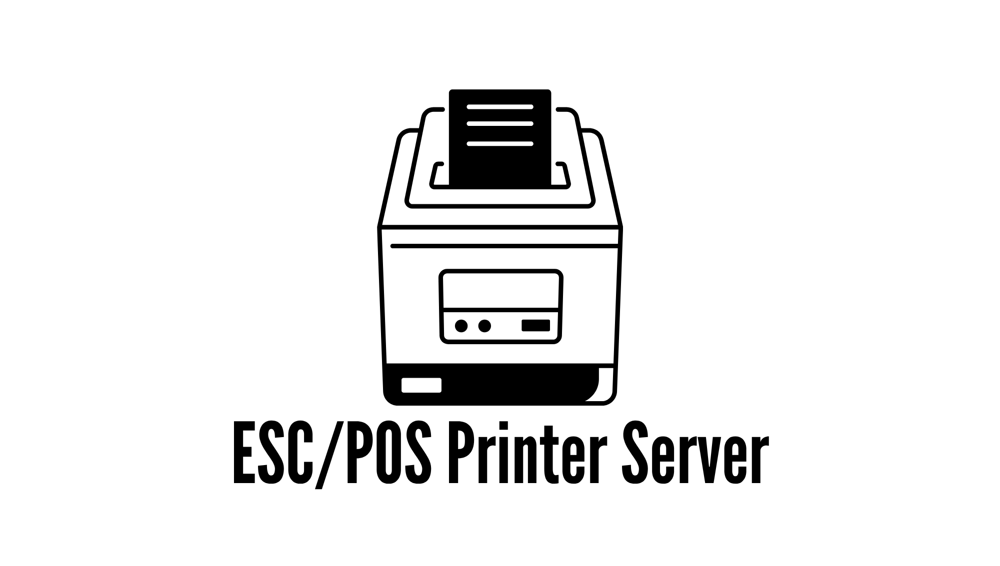

<p align="center">
    <picture>
      <source media="(prefers-color-scheme: dark)" srcset="assets/eps-white.png">
      <source media="(prefers-color-scheme: light)" srcset="assets/eps-black.png">
      
    </picture>
</p>
<p align="center">A simple and efficient ESC/POS printer server built with PHP, <a href="https://github.com/walkor/workerman" target="_blank">Workerman</a> and <a href="https://github.com/mike42/escpos-php" target="_blank">ESC/POS-PHP</a>, providing WebSocket-based printing capabilities for thermal printers.</p>

<p align="center">
  
  
  
  
  
</p>

## Features
- **Cross-platform**: Works on Linux, macOS, and Windows.
- **Multi-interface printer support**:
  - CUPS
  - Ethernet
  - Linux-USB
  - SMB
  - Windows-USB
  - Windows-LPT
- **WebSocket Server** for real-time receipt printing.
- **Built-in Web GUI configuration** accessible via HTTP.
- **Customizable receipt templates** (Epson or custom).
- **Cash drawer control** using ESC/POS pulse command.
- **Structured JSON configuration** for easy setup.
- **Logging system** with rotating daily logs.
- **Printer testing utility**.
- **Bundled Windows service installer (via NSSM).**

## Architecture Overview
The eps (ESC/POS Printer Server) executable bridges your web or desktop application and the thermal printer.
1. The client app (browser, POS app, or API) connects via WebSocket.
2. The EPS server receives JSON payloads and translates them to ESC/POS commands.
3. Commands are sent to the connected printer via the configured interface.

## Installation

### Windows

1. Download `eps-windows-bundle` archive from the [Release Page](https://github.com/darkterminal/escpos-printer-server/releases)
2. Extract somewhere on your system
3. Open directory or extracted content
4. Double Click `eps-install.bat` to install and run ESC/POS Printer Server as a Windows Services
5. Need to uninstall? double click `eps-uninstall.bat` to stop and remove ESC/POS Printer Server from Windows Service

### Linux/MacOS

**Requirement**

- PHP >= 8.3 (Installed)
- PHP Extensions:
  - sockets
  - intl
  - openssl

**Installation Process**

1. Download `eps-unix-bundle` archive from the [Release Page](https://github.com/darkterminal/escpos-printer-server/releases)
2. Extract somewhere on your system
3. Open directory or extracted content
4. See usage section

## Build from Source

### 1. Clone Repository
```bash
git clone https://github.com/darkterminal/escpos-printer-server.git
cd escpos-printer-server
```

### 2. Install Dependencies
```bash
composer install
```

### 3. Build Phar
```bash
composer run create:phar
```
> Note: Phar is generated inside `bin` directory

## Usage

### Windows

ESC/POS Printer Server is already installed on Windows Service Manager.

### Linux/MacOS

1. Open your terminal inside extracted content
2. the run this command `php eps.phar start` or `php eps.phar start -d` to run as a daemon.

## Web GUI & Integration

- Web GUI on: `http://localhost:1100`
- ESC/POS WebSocket Server: `http://localhost:1945`

### Printer Settings Payload


```json
{
  "from": "testprinter",
  "printer_name": "IW-8001",
  "printer_settings": {
    "printer_name": "IW-8001",
    "interface": "ethernet",
    "printer_host": "localhost",
    "printer_port": 1100,
    "template": "epson",
    "pull_cash_drawer": true,
    "line_feed_each_in_items": 1,
    "more_new_line": 0,
    "custom_print_header": [
      "DARKTERMINAL MART",
      "Jl. Merdeka No. 45, Tegal",
      "Open 07:30 - 16:30"
    ],
    "custom_print_footer": [
      "Darkterminal Mart",
      "Belanja Nyaman, Harga Aman"
    ],
    "custom_language": {
      "operator": "Kasir",
      "time": "Waktu",
      "transaction_number": "No TRX",
      "customer_name": "Nama Pelanggan",
      "tax": "Pajak",
      "member": "Diskon Member",
      "total": "Total Belanja",
      "paid": "Tunai",
      "return": "Kembalian",
      "due_date": "Jatuh Tempo",
      "saving": "Tabungan",
      "loan": "Piutang"
    }
  }
}
```

### Receipt Data Payload

```json
{
  "receipt_data": [
    {
      "item_name": "Kopi Robusta 250gr",
      "price": 45000,
      "qty": 2,
      "sub_total": 90000
    }
  ]
}
```

### WebSocket Communication

The Printer Settings & Receipt Data Payload should be merge:

```json
{
  // Printer Settings
  "from": "testprinter",
  "printer_name": "IW-8001",
  "printer_settings": {
    "printer_name": "IW-8001",
    "interface": "ethernet",
    "printer_host": "localhost",
    "printer_port": 1100,
    "template": "epson",
    "pull_cash_drawer": true,
    "line_feed_each_in_items": 1,
    "more_new_line": 0,
    "custom_print_header": [
      "DARKTERMINAL MART",
      "Jl. Merdeka No. 45, Tegal",
      "Open 07:30 - 16:30"
    ],
    "custom_print_footer": [
      "Darkterminal Mart",
      "Belanja Nyaman, Harga Aman"
    ],
    "custom_language": {
      "operator": "Kasir",
      "time": "Waktu",
      "transaction_number": "No TRX",
      "customer_name": "Nama Pelanggan",
      "tax": "Pajak",
      "member": "Diskon Member",
      "total": "Total Belanja",
      "paid": "Tunai",
      "return": "Kembalian",
      "due_date": "Jatuh Tempo",
      "saving": "Tabungan",
      "loan": "Piutang"
    }
  },
  // Receipt Data
  "receipt_data": [
    {
      "item_name": "Kopi Robusta 250gr",
      "price": 45000,
      "qty": 2,
      "sub_total": 90000
    }
  ]
}
```

### WebSocket Client Example (JavaScript)

```javascript
const ws = new WebSocket("ws://localhost:1945");
ws.onopen = () => ws.send(JSON.stringify(escposPayload));
```

## Contributing

1. Fork this repository.
2. Create a new branch (`git checkout -b feature/your-feature`).
3. Commit changes (`git commit -m "Add new feature"`).
4. Push to your branch (`git push origin feature/your-feature`).
5. Open a Pull Request.

For issues or bug reports, please use the [GitHub Issues](https://github.com/darkterminal/escpos-printer-server/issues) page.
